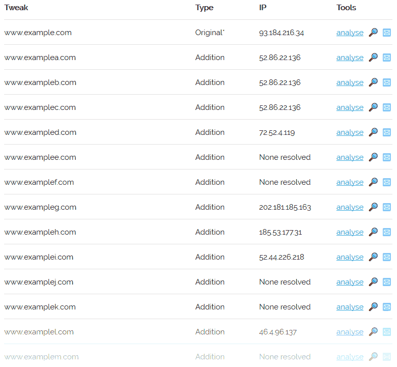

Help
====

What is dnstwister?
-------------------

**dnstwister** generates a list of domain names that are similar to one that
you provide, checking to see if any of them are registered.

How it works
------------

Let's say you `do a dnstwister search on www.example.com
<https://dnstwister.report/search/7777772e6578616d706c652e636f6d>`_.

Firstly, **dnstwister** will generate a list of similar domains - something
like:

..  code-block:: none

    www.examplea.com
    www.examplec.com
    ...
    www.axample.com
    ...

(you can `thank dnstwist <https://github.com/elceef/dnstwist>`_ for the
awesome algorithm)

For each of these domains, **dnstwister** will attempt to resolve a `DNS A
record <https://en.wikipedia.org/wiki/List_of_DNS_record_types#A>`_ - the
mapping between a domain name and an IP address. This will look something
like: 

Successfully resolving a domain to an IP address indicates someone has
registered it.
